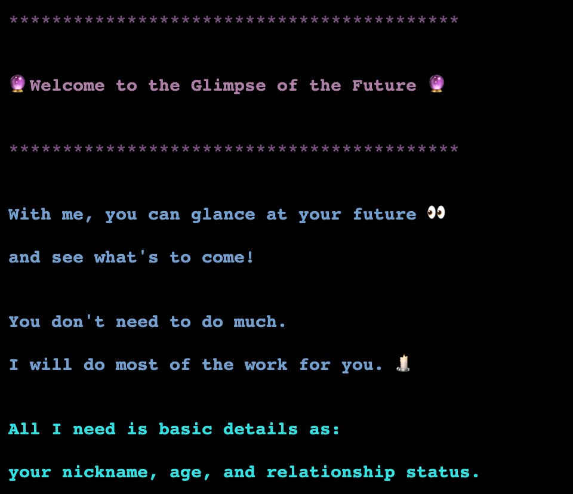
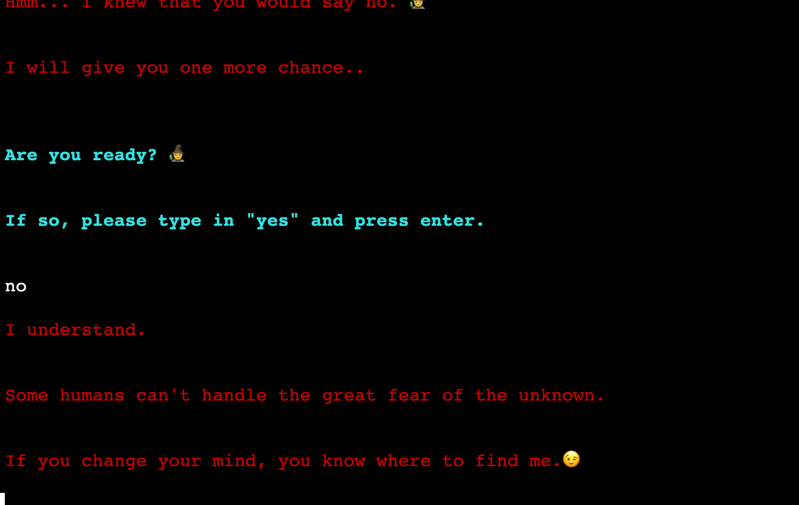
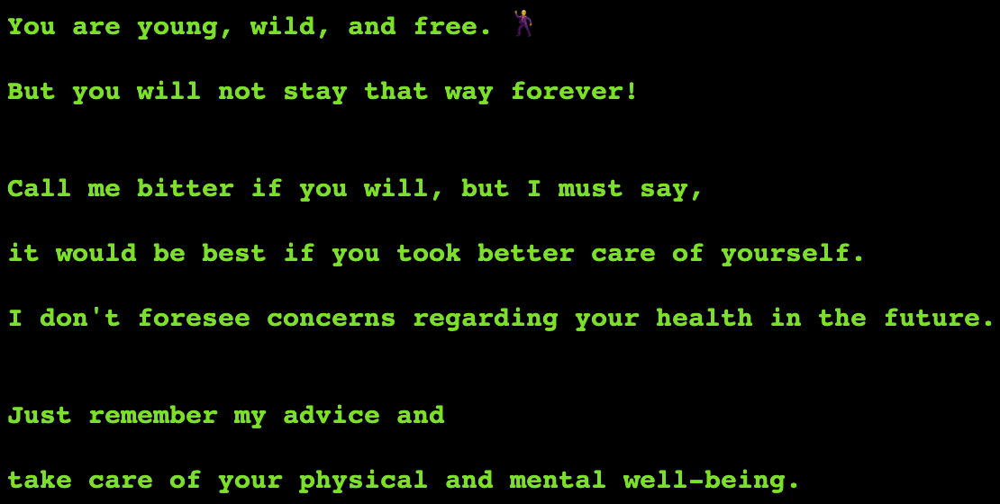
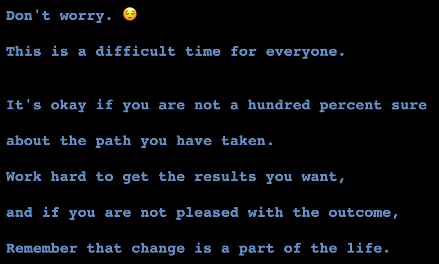
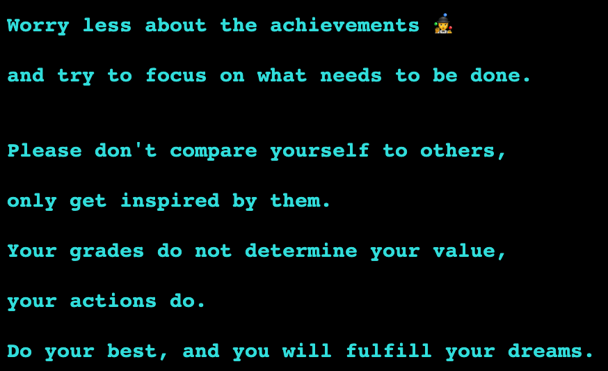
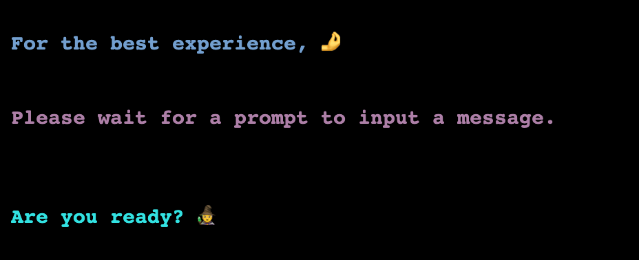

# Glimpse of the Future

The Glimpse of the Future is a Python based text game, deployed with a mock terminal provided by Code Institute, using Heroku.

The main inspirations for this game are Fortune Tellers and Magic 8 ball.

There are four different topics users can select to get predictions: Health, Work, Education, and Relationship. The game requires the user's age and relationship status to provide relevant future predictions. Depending on the collected data, a prediction is displayed and users are given a chance to select another topic. If the user chooses not to continue playing, the game asks for the user's nickname and farewell the user with the input provided.

[Visit the deployed version](https://glimpse-of-future-18938565c6a2.herokuapp.com/)



## Table Of Contents

- [Glimpse of the Future](#glimpse-of-the-future)
- [Planning](#planning)
  - [Flow Chart](#flow-chart)
  - [Data Model](#data-model)
  - [User Experience (UX)](#user-experience-ux)
- [How To Play](#how-to-play)
- [Features](#features)

  - [Existing Features](#existing-features)

    - [Welcome Screen](#welcome-screen)
    - [Select Topic Screen](#select-topic-screen)
    - [User Input](#user-input)
      - [Age](#age)
      - [Nickname](#nickname)
      - [Relatonship Status](#relatonship-status)
    - [Future Predictions](#future-predictions)

      - [Health Predictions](#health-predictions)
      - [Work Predictions](#work-predictions)
      - [Education Predictions](#education-predictions)
      - [Relationship Predictions](#relationship-predictions)

    - [Game End](#game-end)

  - [Future Enhancements](#future-enhancements)

- [Testing](#testing)
  - [Manual Testing](#manual-testing)
  - [Validator Testing](#validator-testing)
  - [Fixed Bugs](#fixed-bugs)
  - [Remaining Bugs](#remaining-bugs)
- [Deployment](#deployment)
- [Deployment to Heroku](#deployment-to-heroku)
- [Libraries](#libraries)
  - [os](#os)
  - [time](#time)
  - [colorama](#colorama)
- [Emoji](#emoji)
- [Credits](#credits)
- [Acknowledgements](#acknowledgements)

# Planning

## Flow Chart

In the planning stage, I used [LucidChart](https://www.lucidchart.com/pages/) to create main logic flow of the game. The final version of the application has a few differences, such as when the game asks for user input or how the game reacts to those inputs. I mentioned it in more detail in the [Data Model](#data-model) section.


# Data Model

- For the logic flow of the game, please refer to the [Flow Chart](#flow-chart).

> In the flow chart, all user inputs are asked right after the welcome text. While writing the code I changed that into asking the input whenever it was needed because it logically made more sense and seemed more suitable to the game.

- In the beginning, I created a one big nested loop the get all user inputs. Even though it functioned, it became too complex and difficult to read, so I separated it into three different functions age, nickname, and relationship.

- Later on I wanted to test my skills further and implement OOP in this project. Because above three functions were getting and returning user data, I created a Class for User and added the functions as methods into the class. This class can be used in future for creating user accounts.

- I tried to refactor the code as much as possible, such as shortening the if-else statements using the Pylint, moving all print statements to text.py, and turning User into a class. My main focus was keeping a clean code while not compromising any functionality.

```py
class User():
    """
    Creates an instance of user
    """
    name = " "
    age = 0
    relationship = " "

    def get_nickname(self):
        """
        Gets user input for nickname in correct form
        and returns user information
        """
        clear_terminal()
        text.get_nickname()
        while True:
            nickname = input(":")
            if nickname.isalpha() and len(nickname) < 10:
                break
            text.incorrect_input()
        self.name = nickname
        return self.name

    def get_age(self):
        """
        Gets user input for age in correct form
        and returns user information
        """
        clear_terminal()
        text.get_age()
        while True:
            userage = input(":")
            if userage.isdigit() and len(userage) < 4:
                break
            text.incorrect_input()
        self.age = userage
        return self.age

    def get_relationship(self):
        """
        Gets user input for relationship status in correct form
        and returns user information
        """
        clear_terminal()
        text.get_relationship()
        while True:
            userrel = input(":")
            if userrel in ["single", "dating", "married"]:
                break
            text.incorrect_input()
        self.relationship = userrel
        return self.relationship

```

## User Experience (UX)

### Site Goals

- Give clear instructions about how to play the game.
- Get and validate the input appropriately.
- Create curiosity with the intro to get users' attention.
- Play the game smoothly and effortlessly.
- Provide future predictions that feel particular to the user.

### Target Audiences

- Individuals who have interest in fortune tellers.
- Individuals who are at the age to have an interest in provided topics.

### User Stories

As a user, i want to;

- Have a clear understanding of how to play the game.
- Get direct instructions for the inputs.
- Get predictions that are suitable for my personal details.
- Have a smooth experience.

# How To Play

1. After the welcome text, to start playing, type yes and enter after the "Are you ready?" question.
2. Four different topics for predictions will be provided, pick one topic and enter the number you selected.
3. Depending on the selected topic, game will ask for inputs like age and relationship status. Correctly enter the answer as shown as in examples and press enter.
4. After the prediction text, the game will proceed with the " Would you like to know more?" question. If the answer is yes, repeat the second and third steps.
5. If the answer is no, the game will ask an input for a nickname, and proceed to the goodbye text.

# Features

## Existing Features

### Welcome Screen

Welcome text greets the user, explains the game, and gives clear instructions for how to play.


> - " Please wait for a prompt to input a message. " is specially added to the welcome text to inform users at the beginning of the game.

After welcoming, the game asks the user if they are ready. If the user answers yes, the game proceeds to the Select topic screen.


If the user answers no, the game gives user a second chance. If the answer is again no, the game proceeds to say goodbye.



Any invalid input returns an error message and asks to try again.

### Select Topic Screen

Provides list of available topics to get future predictions.


The first three topics require users to input their age, fourth topic requires both age and relationship status.

After selecting and entering the topic number, the game proceeds to get the user input.

### User Input

Depending on the selected topic, the game asks user input for age and relationship status.

Any invalid input returns an error message and asks to try again.


#### Age

Age input is requested for all topics.


> User input for age is limited to a maximum of 3 characters.

#### Nickname

The game requests for a nickname after getting the prediction and saying no to Would you like to know more question.
The reason for this is to give the user a feeling more of a personal and life-like experience.

> User input for nickname is limited to a maximum of 9 characters.


#### Relatonship Status

The game requests for relationship input only if the user selects the Relationship topic to provide an accurate prediction.


### Future Predictions

Every topic has multiple predictions and displays a text depending on the collected user data.

#### Health Predictions

Has three different texts:

1. For age between 7 and 25
2. For age between 25 and 45
3. For age between 45 and 100



> Any age that is not described as above range falls into the not-for-you category, inform users that this topic is not suitable for them.


#### Work Predictions

Has three different texts:

1. For age between 15 and 18
2. For age between 18 and 24
3. For age between 24 and 100



> Any age that is not described as above range falls into the not-for-you category, inform users that this topic is not suitable for them.

#### Education Predictions

Has three different texts:

1. For age between 8 and 18
2. For age between 18 and 24
3. For age between 24 and 100



> Any age that is not described as above range falls into the not-for-you category, inform users that this topic is not suitable for them.

#### Relationship Predictions

Has eight different texts:

1. For age between 15 and 19, single
2. For age between 15 and 19, dating
3. For age between 19 and 45, single
4. For age between 19 and 45, dating
5. For age between 19 and 45, married
6. For age between 45 and 100, single
7. For age between 45 and 100, dating
8. For age between 45 and 100, married


> Any age that is not described as above range falls into the not-for-you category, inform users that this topic is not suitable for them.

### Game End

After the user says no to the "Would you like to learn more" question, the game proceeds to get the user's nickname and a goodbye text.


## Future Enhancements

In the future, I would like to use the User class to save user data to the system and allow users to have accounts.

I would like to get additional user data like gender, and interests, and create enhanced future predictions to give more detailed and personalized future predictions.

# Testing

## Manual Testing

- I tested the project throughout the development stage and specified the bugs I encountered in the Fixed Bugs section.

|      Tested invalid inputs      |   Age   | Relationship | Nickname | Select Topic | "yes" & "no" | Input Validation Behaviour |
| :-----------------------------: | :-----: | :----------: | :------: | :----------: | :----------: | :------------------------: |
|         - a letter "a"          | &check; |   &check;    | &check;  |   &check;    |   &check;    |            Pass            |
|    - multiple letters "abc"     | &check; |   &check;    | &check;  |   &check;    |   &check;    |            Pass            |
|         - a number "1"          | &check; |   &check;    | &check;  |   &check;    |   &check;    |            Pass            |
|    - multiple numbers "123"     | &check; |   &check;    | &check;  |   &check;    |   &check;    |            Pass            |
| - an empty _ENTER_ with nothing | &check; |   &check;    | &check;  |   &check;    |   &check;    |            Pass            |
|          - only spaces          | &check; |   &check;    | &check;  |   &check;    |   &check;    |            Pass            |
|  - special characters "? ! @ "  | &check; |   &check;    | &check;  |   &check;    |   &check;    |            Pass            |

|    Inputs    |            Accepted Input             |
| :----------: | :-----------------------------------: |
|     Age      |    only digit, up to 3 characters     |
| Relationship |    "single" & "dating" & "married"    |
|   Nickname   | only alphabetical, up to 9 characters |
| Select Topic |      only digit, in range 1 to 4      |
| "yes" & "no" |             "yes" & "no"              |

|     Browser     | Desktop |                                                                                   Result                                                                                    |
| :-------------: | :-----: | :-------------------------------------------------------------------------------------------------------------------------------------------------------------------------: |
|     Chrome      | &check; |                                                                                  No issues                                                                                  |
|     Safari      | &check; |                                   Emojis are cutted into half, and cannot add any input to the mock terminal. Functionality doesn't work.                                   |
|      Edge       | &check; |                                                                                  No issues                                                                                  |
| Mozilla Firefox | &check; | Emojis are cutted into half, not fully displayed in mock terminal. Text colors seems darker even with the bright style added. Other than that no issues with functionality. |

## Validator Testing

- Both Python files were tested using [CI Python Linter](https://pep8ci.herokuapp.com/).

|  File  |        [CI Python Linter](https://pep8ci.herokuapp.com/)         |     Result      |
| :----: | :--------------------------------------------------------------: | :-------------: |
| run.py |  | No errors found |

|  File   |         [CI Python Linter](https://pep8ci.herokuapp.com/)          |     Result      |
| :-----: | :----------------------------------------------------------------: | :-------------: |
| text.py |  | No errors found |

## Fixed Bugs

> 1. " Make get age functions return value integer to avoid repetition" [main d7117d8](https://github.com/SerraKD/glimpse-of-future/commit/d7117d84e98f8462f5fc214d0cad68560b903a74)

- Otherwise i had to repeat in select topic function loops.

> 2. " Fix the typo in topics function in text.py" [main 3daa1a5](https://github.com/SerraKD/glimpse-of-future/commit/3daa1a5c5fe50f5f0392165fbf9d279caf1b61ae)

- I called relationship topic number 3. Would confuse the user when selecting a topic. I fixed the text as 4.

> 3. " Fix the function call for age in select topic, use returned value instead" [main a7eb663](https://github.com/SerraKD/glimpse-of-future/commit/a7eb6633c3090b64f9c26bd7b099cc94e958bc93)

- I was calling the user_age() function in the if and all the elif blocks in select_topic. So function was being called again for each check. I called the function once and stored the return value. (Credits John from Tutor Assistance)

> 4. " Fix the age range for relationships in select topic function" [main bfaa4cc](https://github.com/SerraKD/glimpse-of-future/commit/bfaa4cccdf593ed93a391bf68c54d07ebfed85e4)

- There was a gap in if-elif loops for age, making it miss a couple of age ranges. I fixed the error by rearranging the range.

> 5. " Fix the code for get relationship functions user input validation by adding list" [main d4a2c7c](https://github.com/SerraKD/glimpse-of-future/commit/d4a2c7c669d780b94a02054c282e834b4d12363d)

- The get relationship function was validating user input by checking if the entered answer is alphabetical. By adding a list of accepted answers in the if loop I ensured that only the correct answer will make the game proceed.

> 6. " Fix the code for game start function, rearrange the calling of the select topic and game start functions" [main c48881b](https://github.com/SerraKD/glimpse-of-future/commit/c48881b6c615ce3d622e3da8f6a95bce499acaa1)

- Because of the calling of the select topic function, even if the user says no to continue playing game was proceeding with giving the user options to select a topic. By moving the game start function under the select topic function I managed to prevent unwanted loops. I also added another while true to to nested loop to make sure the function behaves as expected.

> 7. " Add style bright to texts in text.py" [main 96cfb72](https://github.com/SerraKD/glimpse-of-future/commit/96cfb72bbceabe3e1f134d263ce6910156f68bea)

- There was a bug in Heroku causing the colorama text colors to seem darker than the terminal in Gitpod. I added a bright style to ensure that the text is easily readable.

> 8. " Refactor all if else statements with Pylint in run.py" [main 4663398](https://github.com/SerraKD/glimpse-of-future/commit/4663398ed221f6535539d33de08b284fb02e77b8)

- Because all if-else statemens had breaks, I removed unnecessary elif and else statements for cleaner code.

> 9. " Fix the code for game start function, make input validation work correctly" [main ae5d6bc](https://github.com/SerraKD/glimpse-of-future/commit/ae5d6bc6e49a46b87b7fca2e5083b3586e70fed7)

- After adding changes to if-else statements with Pylint, I found a new bug in the game start functions input validation. When a user enters incorrect answer, it creates an infinite loop. By removing the secondary while statement, adding the else statement, and correcting the indentation I fixed the error.

> 10. " Add lenght to get nickname and and get age methods to limit the amount of characters user can input" [main 451565e](https://github.com/SerraKD/glimpse-of-future/commit/451565e3fe54fd9308cd6dce08d31cb4a7a3461b)

- Before the get nickname and get age methods were only checking if the input was in the correct format, by adding the length to loops I made sure that users could only enter a certain amount of characters.

> 11. " Add a blank space infront of all text for better look on mock terminal" [main e36ad42](https://github.com/SerraKD/glimpse-of-future/commit/e36ad42381940be5fc75b489cba84c2f3abc3376)

- On the Heroku mock terminal, all text was pushed too far to the left side, causing an unpleasing look for the game. I added a blank space in front of all print statement texts to fix this.

> 12. " Remove the last clear terminal call in game start" [main 3521667](https://github.com/SerraKD/glimpse-of-future/commit/3521667a2dddee2f5eed470c5ac7578ea5d59720)

- When user answers incorrect to the "are you ready" question, the clear terminal call at the end of the game start loop was deleting the the error message before even it is shown to user. By removing the call i resolved the issue.

## Remaining Bugs

- Users can input a message before the prompt.

Unfortunately, I couldn't work on this bug but I added an exclusive text to the welcome screen to inform the user to wait for a prompt.

> 

# Deployment

I used [Gitpod](https://gitpod.io/) to develop this website.

I deployed the website in early stages of develepment on [GitHub](https://github.com/) with following steps;

1. Log in to Github and go to projects' repository.
2. Find the Settings on the top of the repository and click.
3. On the left side of the screen, find Pages and select.
4. Under the Branch section, click on the dropdown that says none, and pick "Main" and click on save button.
5. The page is now deployed.

## Local Deployment

- You need to install Python in your workspace for local deployment of this project.

**Fork**:

1. Log in to Github and go to projects' repository.
2. On the top right side of the page, click on _fork_ button.

**Clone**:

1. Log in to Github and go to projects' repository.
2. On the top of the file lists, click on _Code_ button.
3. Whether you want to use HTTPS, SSH key or Github CLI select it, and then click on copy.
4. Open the terminal, type **git clone** and paste the URL copied.
5. Press enter and local clone is now created.

# Deployment to Heroku

1. Log in or create an account in [Heroku](https://dashboard.heroku.com/).
2. Click the New button and select New App.
3. Give the app a unique name and choose the region.
4. Click the Create app button.
5. Go to settings and click to the Reveal Config Vars.
6. Add PORT = Key , 8000 = Value and click add button.
7. Add build packs, Python and Node.js. The order has to be Python first and Node.js second.
8. If they are not in this order, click and drag to correct it.
9. Click Deploy at the top of the page and to go to the Deployment.
10. Select GitHub as the deployment method and confirm connecting your Github account.
11. Search for the repository name and click connect button.
12. You can either use Automatic deploys or Manual deploys depending on your preference.
13. Once completed click Open App.

# Libraries

## os

- os used to clear text in terminal.

- https://docs.python.org/3/library/os.html

## time

- Time is used to add delays to texts.

- https://www.geeksforgeeks.org/sleep-in-python/?ref=lbp

## colorama

- Colorama Fore and Style is used to add different colors to text in terminal.

- https://pypi.org/project/colorama/

# Emoji

- Emojis are used to make texts more interesting and give users a fun experience.

- Importing emoji was not necessary because I used Unicodes.

- Unicodes taken from : https://unicode.org/emoji/charts/full-emoji-list.html

- https://pypi.org/project/emoji/

# Credits

- All content is written by me.
- https://childmind.org/article/how-to-help-kids-have-good-romantic-relationships/ Used as a reference to create appropriate relationship advice for teens.
- [LucidChart](https://www.lucidchart.com/pages/) used to create game flow chart.
- [Grammarly](https://app.grammarly.com/) Used to check the grammar of all text content.
- [Tiny PNG](https://tinypng.com/) used for file compression.
- [CI Python Linter](https://pep8ci.herokuapp.com/) used for validator testing.
- The Heroku mock terminal is provided by [Code Institute](https://codeinstitute.net/global/).
- Clear terminal function is taken from https://stackoverflow.com/questions/2084508/clear-the-terminal-in-python

  > Below documents and sites were used as study and reference material.

- https://www.geeksforgeeks.org/print-colors-python-terminal/
- https://www.geeksforgeeks.org/python-program-to-print-emojis/
- https://www.geeksforgeeks.org/python-check-if-given-string-is-numeric-or-not/?ref=header_search
- https://stackoverflow.com/questions/74662334/using-user-input-function-in-classes
- https://www.tutorialspoint.com/how-do-i-call-a-variable-from-another-function-in-python#:~:text=To%20summarize%2C%20when%20it%20comes,requirements%20of%20the%20specific%20scenario.
- https://www.geeksforgeeks.org/python-string-lower/?ref=header_search
- https://stackoverflow.com/questions/8761778/limiting-python-input-strings-to-certain-characters-and-lengths

# Acknowledgements

- I am deeply grateful to my Mentor Rory Patrick Sheridan, for his invaluable guidance, support, and great tips.
- Special thanks to John from Tutor Assistance for his help and great explanation.
